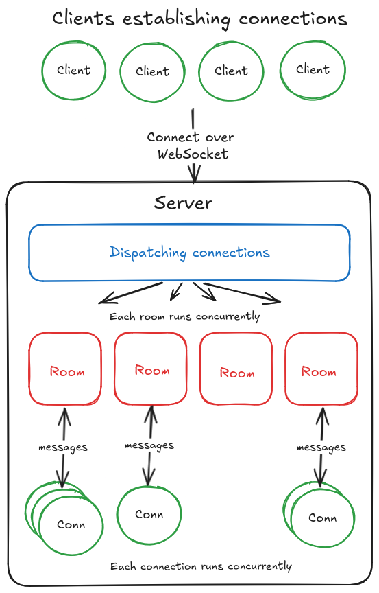

## Introduction

2D game engine built on top of Ebiten, designed to simplify the development of 2D multiplayer games in Go. Empowers developers to create high-performance games with minimal setup and useful set of features.

## Features

- **Cross-Platform Support:** Compile your game for desktop, web, and consoles like Nintendo Switch.
- **Physics Engine:** Integrated physics system for smooth collision detection and movement.
- **Animated Sprite Rendering:** Easy-to-use animated sprite system to bring your characters and environments to life.
- **Tile Maps:** Support for large, efficient tile maps with multiple layers.
- **Scene Management:** Manage different game states and scenes with ease.
- **Entity Management:** Built-in entity management for handling game objects and components.
- **Multiplayer Support:** Simplified creation of game servers with built-in support for multiple rooms or instances, including automatic message serialization over websocket.
- **Ease of Use:** Only three interfaces need to be implemented to set up a complete project.

## Architecture



## Getting Started

### Client template 
```golang

// MainScene defines the main scene of the game.
var MainScene = gelly.Scene{
	Name:   "MainScene",
	Layers: []gelly.Layer{&GameUI{}, &GameClient{}},
}

func main() {
	log.Fatal(gelly.Run(MainScene))
}

// GameClient implements the gelly.Layer interface for the game logic.
type GameClient struct {
	camera gelly.Camera
	player gelly.Vector2
}

// Init is called once at startup to load and set up the game.
func (g *GameClient) Init(c *gelly.Client) {
	g.camera = gelly.NewFollowingCamera(1280, 720, 1280, 720)
	g.player = gelly.Vector2{X: 100, Y: 100}

	// Load files...
	// Set up game state...
}

// Message handles custom user messages.
func (g *GameClient) Message(c *gelly.Client, msg gelly.Message) bool {
	// Handle user custom messages.
	// switch msg.(type) {
	// }

	// Write messages to other layers.
	// c.Write(gelly.Local, &CustomUserMessage{})

	// Return true to capture the message.
	return false
}

// Update is called periodically to update the game state.
func (g *GameClient) Update(c *gelly.Client, dt time.Duration) {
	g.player.X += 1

	g.camera.Follow(g.player)
}

// Draw is called to render the game.
func (g *GameClient) Draw(r *ebiten.Image) {
	sprite := gelly.Sprite{
		Centered: true,
		FlipH:    true,
		Transform: gelly.Transform{
			Position: g.player,
		},
		// Image: CustomUserImg,
	}

	// Draw on the camera surface.
	sprite.Draw(g.camera.Surface)

	// Draw the camera on the ebiten image.
	g.camera.Draw(r)
}

// Dispose is called once on closing to clean up resources.
func (g *GameClient) Dispose(c *gelly.Client) {
}

```

### Server template 
```golang
package main

import (
	"context"
	"log"
	"time"

	"github.com/raphadam/gelly"
)

func main() {
	ctx := context.Background()

	log.Fatal(gelly.Serve(
		ctx,                 // your own context
		"127.0.0.1:9090",    // address to serve
		time.Millisecond*20, // initial tick rate
		&GameServer{},       // your game server
	))
}

// GameServer manages different game rooms and dispatches incoming connections.
type GameServer struct {
	Room1 *gelly.Room
	Room2 *gelly.Room
}

// Init is called once on startup to set up state and rooms.
func (g *GameServer) Init(s *gelly.Server) {
	// Each room runs in its own goroutine.
	g.Room1 = s.CreateRoom(time.Millisecond*30, &GameRoom{})
	g.Room2 = s.CreateRoom(time.Millisecond*30, &GameRoom{})

	// You can create any type of room.
	// g.WaitingRoom = s.CreateRoom(time.Second*5, &WaitingRoom{})
	// g.AfkRoom = s.CreateRoom(time.Second*5, &AfkRoom{})
}

// FindRoom is called when a user connects to the server.
func (g *GameServer) FindRoom(s *gelly.Server, conn *gelly.Conn) {
	// Here, you can decide to close the incoming connection.
	// if reason != nil {
	//     conn.Close()
	// }

	// Or you can join a room.
	g.Room1.Join(conn)
}

// Tick is called periodically to update the server state.
func (g *GameServer) Tick(s *gelly.Server, dt time.Duration) {
	// You can broadcast a message to any room.
	// g.Room1.Broadcast(&gelly.CustomUserMessage{})

	// You can change the tick rate of a room.
	// g.Room1.ChangeTickrate(time.Hour * 3)
}

// LeftRoom is called when a user leaves a room or is kicked.
func (g *GameServer) LeftRoom(s *gelly.Server, conn *gelly.Conn, room *gelly.Room, reason error) {
}

// Dispose is called once on server shutdown to dispose of resources.
func (g *GameServer) Dispose(s *gelly.Server) {
}

// GameRoom is where you write the actual game logic.
type GameRoom struct {
	users map[*gelly.Conn]any
}

// Init is called once to initialize the room.
func (gr *GameRoom) Init(r *gelly.Room) {
	gr.users = make(map[*gelly.Conn]any)
}

// Join is called when a user joins the room.
func (gr *GameRoom) Join(r *gelly.Room, conn *gelly.Conn) {
	gr.users[conn] = struct{}{}

	// You can decide here to kick the connection at any moment.
	// r.Kick(conn)
}

// Message is called when a user sends a message to the room.
func (gr *GameRoom) Message(r *gelly.Room, conn *gelly.Conn, msg gelly.Message) {
	// You can type switch to get the underlying message type.
	// switch m := msg.(type) {
	// case *CustomUserMessage:
	// 	m.Something = 32
	// }

	// You can write a message to any connection concurrently.
	// conn.Write(&CustomMessageResponse{text: "hello"})

	// You can update your internal game state here.
}

// Tick is called periodically to update the room state.
func (gr *GameRoom) Tick(r *gelly.Room, dt time.Duration) {
}

// Left is called when a user leaves the room.
func (gr *GameRoom) Left(r *gelly.Room, conn *gelly.Conn) {
}

// Dispose is called once to dispose of the room resources.
func (gr *GameRoom) Dispose(r *gelly.Room) {
}

// MainScene defines the main scene of the game.
var MainScene = gelly.Scene{
	Name:   "MainScene",
	Layers: []gelly.Layer{&GameUI{}, &GameClient{}},
}

func main() {
	log.Fatal(gelly.Run(MainScene))
}
```
